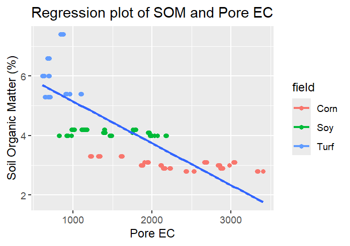

# **Soil Organic Matter**
Results show a trend with corn as the lowest SOM followed by soy in the middle and turf with the highest. This is evaluated by SOM levels of low medium and high provided by the lab [som_data](https://github.com/RTGS-Lab/2024_SOM_EC_NSF_REEU/blob/master/preprocessed/som_data.xlsx) and box plots created from mass percent. The result of turf being the highest based on no tillage was expected. Soy being higher than corn is interesting because corn was at a higher vegetation stage than soy also it seems that corn leaves more residue after harvest and I would think this would add to higher SOM.

# **Bulk Ec**
The results of this variable were not expected. Box plots revealed a pattern of corn, soy, turf in order from highest to lowest. Based on literature it is expected that EC would trend in the same direction as SOM. Regression plots show a weak negative correlation (r = 0.34)  with SOM with all fields, but a strong negative in corn and soy and weak positive with turf. The likelihood of fertilizer accumulation is suspected to be the reason for such high levels of electrical conductivity in the crop fields. Another possible influence is soil compaction in the turf site not allowing for the sensor to read the soil particle component of bulk EC very well.

# **Pore EC**
The boxplot of pore EC by field shows the same descending trend as bulk EC which is the inverse of SOM. Again, fertilizer salts are the main reasoning behind why the crop fields have higher than expected levels of electrical conductivity. However, the regression line for pore EC versus SOM has a much higher correlation coefficient (r = -0.78) than bulk EC. The plot still trends in the negative direction though. The levels of SOM stay in the same ranges within the field type but the crop fields have longer ranges with EC. Preliminary ideas for these results include differences in samples from within row and outside rows do to water uptake by plants.

# **Permittivity**
A boxplot of permittivity by field trends in the same direction as SOM boxplot. This is an expected result. The regression line has a strong positive correlation of r = 0.88. Measuring soil moisture with permittivity seems to be the strongest predictor of SOM.

# **Soil Temperature**
This data analysis shows that soil temperatures were highest in soy, with corn in the middle, then turf as the lowest. An explanation for this is the variation in growth stages the soy and corn were in, resulting in a lot of direct sunlight to bare soil for the soy and a larger amount of vegetation cover for the corn. Turf was located in a location with tree coverage and there was no bare soil exposed

# **Volumetric Water Content**
The VWC is almost as strongly correlated (r = 0.87) with SOM as permittivity. Permittivity and VWC are ways of measuring soil moisture  In soil, water is usually the only material with a high permittivity, so measuring the dielectric permittivity of soil can help estimate its water content.

